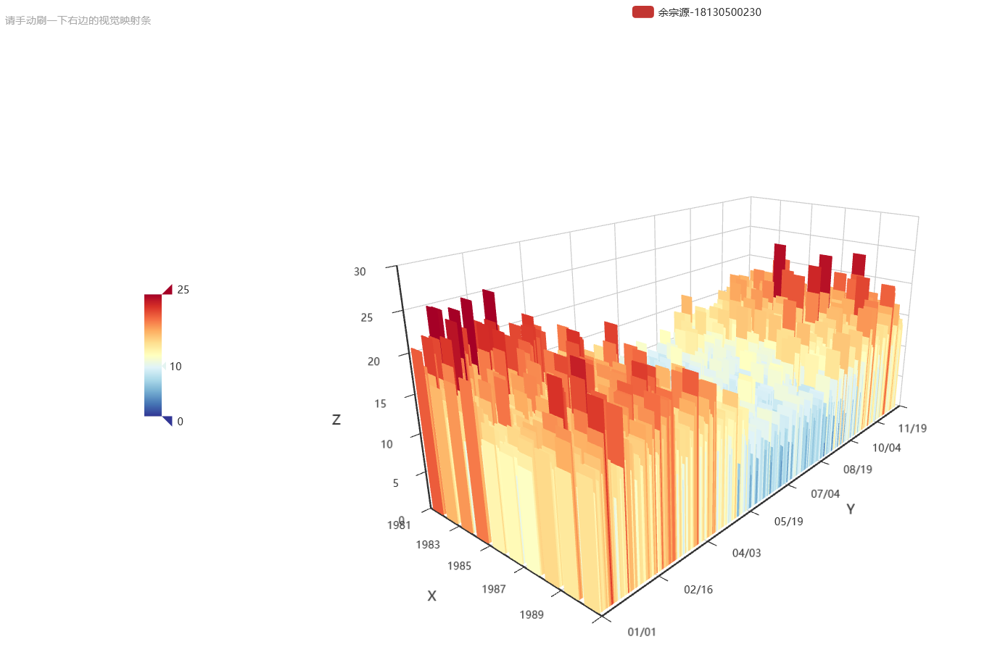

#数据可视化实验二：统计图可视化

[TOC]

##简介
- 姓名：
- 学号：
- 实验日期：2020/10/15
- 实验环境：window10
- 实验工具：pycharm,  pyecharts 1.7.1
- 实验要求：
	- 对daily-minimum-temperatures-in-me.csv中的数据进行处理
	- 使用编程可视化工具实现三维效果

##实验过程
- 导入的库：
	- csv,  pyecharts
- 思路：
	1.  先导入数据进行处理，把year/month/day的时间格式变为year和month/day的二维格式
	2.  以year和month/day为x, y轴，以每天对应的温度为z轴画图
	3.  新建一个Bar3D，把队友数据填入x, y, z轴即可得到图形

##实验结果
- 运行文件，获得三维图像。截图：

- 最后的图像和实验要求相同，本次实验成功 

## 心得体会
第一次学习和使用pyecharts库， 学习了一些新的知识，丰富了自己的知识面，收获颇丰

