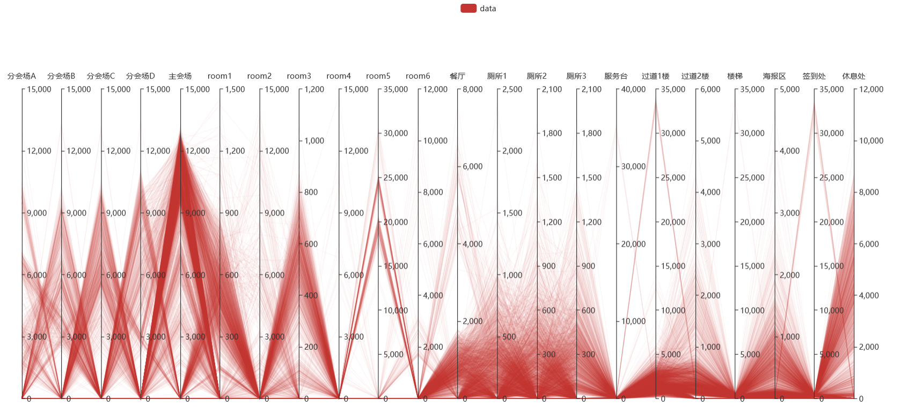
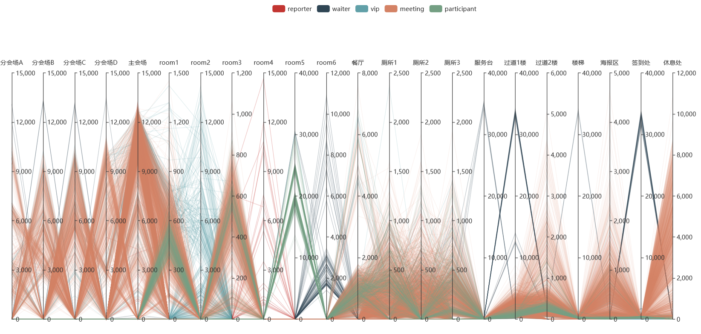
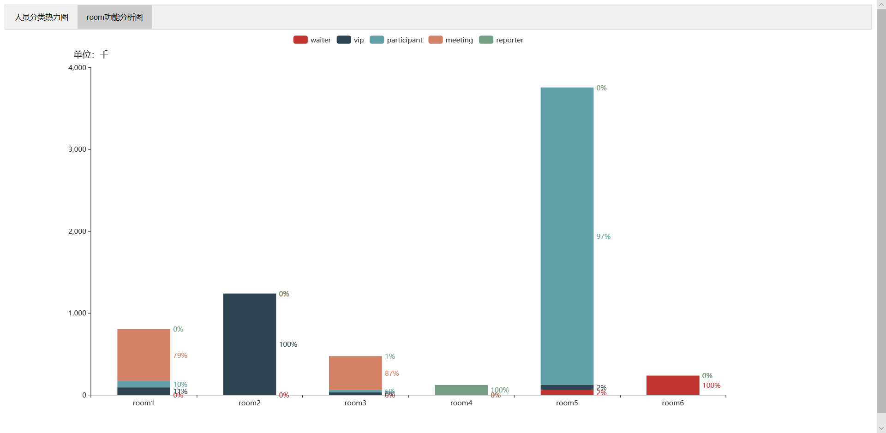

# 数据可视化实验五：高维非空间数据可视化

[toc]

## 简介

- 姓名：余宗源

- 学号：18130500230

- 实验日期：2020/10/17

- 实验环境：window10

- 实验工具：pycharm,  pyecharts 1.7.1

- 实验要求：

  - 在某次大型会议中，为确保会议过程安全，会场使用了电子胸牌对场内人员的移动轨迹进行了监控。现经过处理，得到了某一天内人员在场内各个区域逗留的时间统计数据（time_allocate_day1.csv）。请根据这份数据，完成以下任务：

    ​	1.设计可视化方案，要求通过该方案可以实现对人员的分类（分类结果已给出，仅绘制出图像即可）

    ​	2.请根据上述图像，分析会场中room1~6的功能。

    ​	3.提示：

    - 人员可以分为场内工作人员（waiter）、嘉宾（vip）、记者（reporter）、黑客竞赛参赛者（participant），以及普通参会成员（meeting）。
    - Room1~6分别为休息区（两处）、嘉宾休息区、记者区、黑客竞赛现场、工作人员休息区。

## 实验过程

- 导入的库：

  - pandas,  pyecharts

- 思路:

  1.设计可视化方案，要求通过该方案可以实现对人员的分类：	

  * 先获取所有的id对应的类别，将其用字典的方式存储，同时写出所有房间的scheme。

  * 循环所有的数据，通过id的类型将其对应到对应的数据列表中去：

    ```python
    for line in df2.value_counts().index:
        data_all.append(line[1:])
        if classfication_origin[line[0]] == "meeting":
            data_meeting.append(line[1:])
        elif classfication_origin[line[0]] == "participant":
            data_participant.append(line[1:])
        elif classfication_origin[line[0]] == "vip":
            data_vip.append(line[1:])
        elif classfication_origin[line[0]] == "waiter":
            data_waiter.append(line[1:])
        elif classfication_origin[line[0]] == "reporter":
            data_reporter.append(line[1:])
    ```

  * 画出两个图，第一个图是在不知道id分类的前提下画出的所有id在不同房间停留时间的平行坐标图，第二个图是在知道id分类的前提下画出的附带人员分类的id在不同房间停留时间的评选坐标图，为了方便观察。

    

  2.每类人员在不同房间的停留时间比例的折线图：

  + 用一个二维列表来表示每类人员在每个房间的停留时间，其中行表示5类人员分类，列表示在6个房间里的停留时间

  + 首先计算出每列的和，然后循环求出每类人员对每列即每个root访问时间的占比，以及其时间数据的1/1000以方便展示：

    ```python
    # 算出每个的比例
    room_total_time = []
    room_stay_time_rate = []
    room_stay_time_thousand = []
    data = []
    
    # 计算每一列的和
    for i in range(0, 6):
        room_total_time.append(sum(num[i] for num in room_stay_time))
    
    # 求出每一种人员对于room的访问时间占比，同时将其访问时间按比例缩小1000
    for i in range(0, 5):
        num = sum(room_stay_time[i])
        rate = []
        thousand = []
        for j in range(0, 6):
            rate.append(round((room_stay_time[i][j] / room_total_time[j]), 3))
            thousand.append(room_stay_time[i][j] / 1000)
        room_stay_time_rate.append(rate)
        room_stay_time_thousand.append(thousand)
    
    # 为bar填充数据，同时保存其值和对应的占比
    for i in range(0, 5):
        y = []
        for j in range(0, 6):
            y1 = {"value": room_stay_time_thousand[i][j], "percent": room_stay_time_rate[i][j]}
            y.append(y1)
        data.append(y)
    ```

  + 根据数据画出对应的柱形图，将柱形图加入到tab上。

## 实验结果

+ 运行程序得到人员类别分析（不知道类别分类）对应的平行折线图：
+ 

+ 运行程序得到人员类别分析（知道人员分类）对应的平行折线图：
+ 

+ room功能分析柱形图：

+ 

  room功能分析：

  + room1：我们由图可知，其中meeting停留时间占比79%，故可推知其为休息处。
  + room2：我们由图可知，其中vip人员停留时间占比高达100%，故可知其为嘉宾休息区。
  + room3：我们由图可知，其中meeting停留时间占比87%，故可推知其为休息处。
  + room4：我们由图可知，其中reporter停留时间占比高达100%，故可知其为记者区。
  + room5：我们由图可知，其中participant停留时间占比高达97%，故其为黑客竞赛现场。
  + room6：我们由图可知，其中waiter停留时间占比高达100%，故其为工作人员休息区。

+ 最后得到的图像与分析符合实验要求，实验成功。