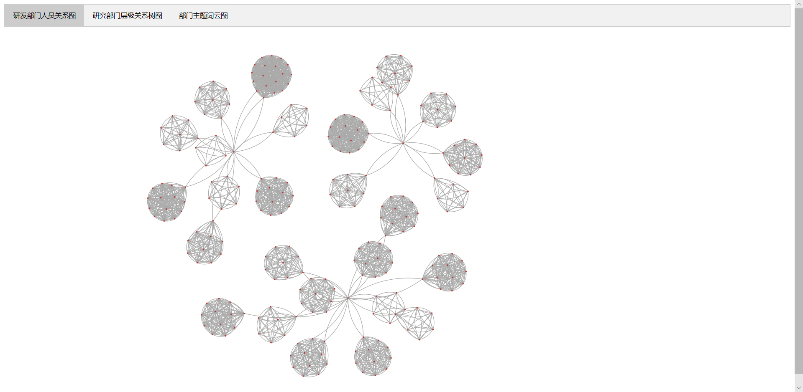

# 数据可视化实验六：层次和网络可视化 文本可视化
[TOC]

## 简介

- 姓名：余宗源
- 学号：18130500230
- 实验日期：2020/10/23
- 实验环境：window10
- 实验工具：pycharm,  pyecharts 1.7.1
- 实验要求：
  - 现有xx公司一个月内研发部门成员间的邮件往来记录（email_dev_inside.xlsx），请根据以下要求完成对该公司的研发部门的可视化分析：
    - 对邮件往来数据进行处理，选择合适的图表，展示公司研发部门的成员组织结构，分别找出每个群体的负责人。
    - 对邮件内容数据进行处理，分析研发部门以及每个群体中的主要工作内容。

## 实验过程

- 导入的库：

  - pandas,  pyecharts

- 思路:

    1.公司员工直接邮件发送关系图：

  + 由数据(email_dev_inside.xlsx)提取出公司所有的员工，由他们邮箱的前四位生成nodes，每次邮件的发送关系from和to生成node之间的连接关系links：

    ```python
    nodes = []
    links = []
    
    # 获取连接关系
    for line in df.value_counts().index:
        link = {'source': line[6][:4], 'target': line[7][:4]}
        links.append(link)
    
    # 获取节点
    for index in df["from"].value_counts().index:
        node = {
            "name": index[:4],
            "symbolSize": 3,
            "value": 1,
            "draggable": "False",
            "category": ""
        }
        nodes.append(node)
    ```

  + 由连接关系links和节点集合nodes可以画出员工之间的邮件发送关系图，并将其放在tab上。

  2.根据关系图，画出部门之间的层级树图：

  + 由关系图，可以得到共有3个相互独立的部门，这三个部门的负责人为1007， 1059， 1068

  + 在links中，查找三位第一负责人下属的其他第二负责人：

    ```python
    # 由画出的graph图中可知，其中有三个部门，这三部门的负责人为1007, 1059, 1068
    head = ["1007", "1059", "1068"]
    head_second = []
    head_third = []
    
    # 获取第二负责人
    for head1 in head:
        head_2 = []
        for link in links:
            if link['source'] == head1:
                if link['target'] not in head_2:
                    head_2.append(link['target'])
        head_second.append(head_2)
    ```

  + 在links中，由第二负责人可找到其每位下属的员工：

    ```python
    # 获取第三负责人
    for head1 in head_second:
        head_3 = []
        for head2 in head1:
            head_3_2 = []
            for link in links:
                if link['source'] == head2:
                    if link['target'] not in head_3_2:
                        head_3_2.append(link['target'])
            head_3.append(head_3_2)
        head_third.append(head_3)	
    ```

  + 由上述获得的负责人层级关系，可画出相应的树形图，并将其放在tab上。

   3.由树形图，可分析出共有30个部门，提取30个部门的邮件主题可画出词云：

  + 根据2图提取出来的30个部门员工，在数据(email_dev_inside.xlsx)中提取出每个部门员工每个邮件主题出现的次数：

    ```python
    # 生成词云数据
    cloudword = []
    for i in range(0, 3):
        for j in head_third[i]:
            word = {}
            words = []
            person = j
            person.append(head_second[i][head_third[i].index(j)])
            for line in df.value_counts().index:
                if line[6][:4] in person:
                    if line[8] in word:
                        word[line[8]] += 1
                    else:
                        word[line[8]] = 1
            for k in word.keys():
                words.append((k, word[k]))
            cloudword.append(words)
    ```

  + 由此生成的词云数据，为了方便查看将每个部门的邮件主题分析词云放在timeline上，并将其放在tab上。

## 实验结果

+ 运行程序可得到第一个公司员工邮件发送关系图：

+ 

  由可分析出研发部门共有3个分别独立的部门，同时可看到每个部门都有一个独立的负责人，其为：1007， 1059， 1068

+ 对图一进行分析，可得到第二个图，公司员工层级关系树形图：

+ 

+ 对图二的每个部门分析可得每个部门邮件主题词云图：

+ 

+ 

+ 对此30个部门进行分析，可以得到其各自的工作内容（用邮箱前四位数字来代表每位员工， 用负责人来代表一个群体）：

  + 1007部门：

    | 群体负责人 |       群体工作内容       |
    | :--------: | :----------------------: |
    |    1230    |    项目设计和项目测试    |
    |    1223    |    项目部署，项目测试    |
    |    1199    |         后端开发         |
    |    1192    |    项目设计，文档说明    |
    |    1172    |       项目开发设计       |
    |    1125    |         概要设计         |
    |    1115    | 项目测试，部署，前端开发 |
    |    1092    |      需求和api汇总       |
    |    1087    |    技术分享，项目管理    |
    |    1281    |    项目部署，软件测试    |

  + 1059部门：

    | 群体负责人 |         群体工作内容         |
    | :--------: | :--------------------------: |
    |    1079    |         技术分享安排         |
    |    1058    |      概要设计，传输设置      |
    |    1057    |      项目设计，项目管理      |
    |    1096    |           软件施行           |
    |    1080    |    软件开发设计，需求调研    |
    |    1101    |     系统配置子系统，接口     |
    |    1119    |        软件实施，分析        |
    |    1228    |        软件需求，实施        |
    |    1211    |      软件开发，用户手册      |
    |    1155    | 特殊字段说明，地图配置，部署 |
    |    1143    |      项目测试，软件实施      |
    |    1487    |   软件实施，开发，项目管理   |
    |    1376    |      需求调研，项目设计      |

  + 1068部门：

    | 群体负责人 |          群体工作内容          |
    | :--------: | :----------------------------: |
    |    1207    |            软件测试            |
    |    1209    |      软件开发，设计，管理      |
    |    1191    |       项目文档，软件测试       |
    |    1154    |           需求和设计           |
    |    1100    |     分析平台配置，api汇总      |
    |    1098    | 分析平台配置，项目测试数据分析 |
    |    1060    |  项目测试，用户手册，地图配置  |

+ 最后得到的图像与分析符合实验要求，实验成功。
