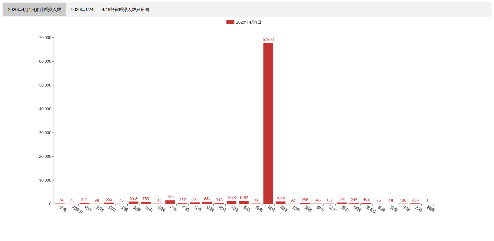
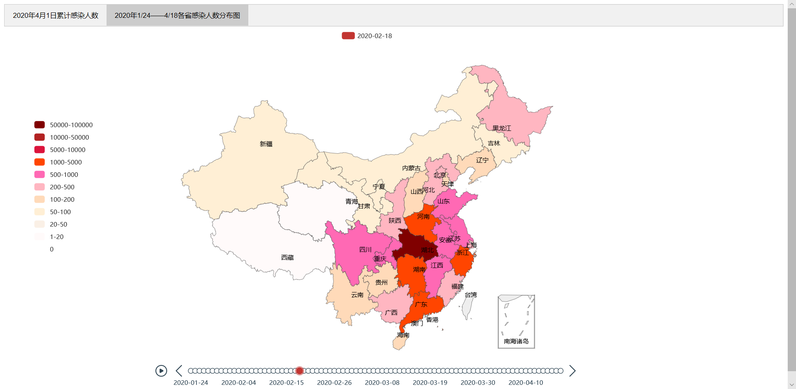

# 数据可视化实验四：地理数据可视化

[TOC]

## 简介

- 姓名：余宗源
- 学号：18130500230
- 实验日期：2020/10/16
- 实验环境：window10
- 实验工具：pycharm,  pyecharts 1.7.1
- 实验要求：
  - 利用已有数据（CityData.xlsx）与已有工具，设计可视化方案，展示2020年全国新冠患者人数随时间的变化过程并完成以下任务：
    - 任务一：统计截止4月1日各省的累计确诊数量，并通过图表展示。
    - 任务二：对每日各省的累计确诊患者数量进行统计，为图像添加时间轴，通过时间轴自动播放演示疫情发展的整个过程。

## 实验过程

- 导入的库：

  - pandas,  pyecharts, copy

- 思路:

  - 首先遍历数据从中提取出所有出现过的日期数据，并将其存放在dates中

  - 再次遍历数据从中获取出所有的省份，同时去掉后缀变成pyecharts可识别的省份字符串。同时以 [省份：0] 的格式来存储每个省份及其感染人数。

  - 先将num_last中每个省份的感染人数初始化为0，然后遍历日期列表，用列表num来表示当天的感染人数，用num_last来表示前一天的感染人数，如果当天有数据则将对应省份的感染数量修改，在操作完毕后把num赋值给num_last，开始下一次循环(此时有一个注意点，在获取4月1日数据时要使用深复制，否则显示的数据会变成最新的num即4月18数据):

    ```	python
    # 获取每天的确诊人数
    for date in dates:
        # num表示当天数据， num_last表示前一天数据
        num = num_last
        # 如果对应日期有数据则进行修改
        for i in data:
            i[0] = i[0].split("市")[0]
            i[0] = i[0].split("省")[0]
            i[0] = i[0].split("维吾尔自治区")[0]
            i[0] = i[0].split("回族自治区")[0]
            i[0] = i[0].split("壮族自治区")[0]
            i[0] = i[0].split("自治区")[0]
            for line in num:
                if i[1] == date and line[0] == i[0]:
                    line[1] = int(i[2])
        # 画出4月1日的各省累计确诊感染人数柱状图
        if date == "2020-04-01":
            bar = (
                Bar(init_opts=opts.InitOpts(width="1500px", height="650px"))
                .add_xaxis(province)
                .add_yaxis("2020年4月1日", copy.deepcopy(num))
                .set_global_opts(xaxis_opts=opts.AxisOpts(axislabel_opts=opts.LabelOpts(rotate=-30)),)
            )
            tab.add(bar, "2020年4月1日累计感染人数")
        # 画出每天对应的地理图
        m = (
            Map()
            .add(series_name=date, data_pair=num, maptype="china", is_map_symbol_show=False)
            .set_global_opts(
                visualmap_opts=opts.VisualMapOpts(is_piecewise=True, pieces=pieces, pos_top="25%", pos_left="3%"),
            )
        )
        # 把每天的地理图加到timeline上
        t.add(m, date)
        num_last = list(num)
    ```

  - 时间线轮播多图画完后，将其添加到tab上

##  实验结果

+ 运行程序得到第一个“2020年4月1日各省感染人数”柱形图：
+ 
+ 得到第二个“2020年1/24——4/18每日感染人数分布timeline”图：
+ 
+ 最后得到的图像和实验要求相同，本次实验成功。