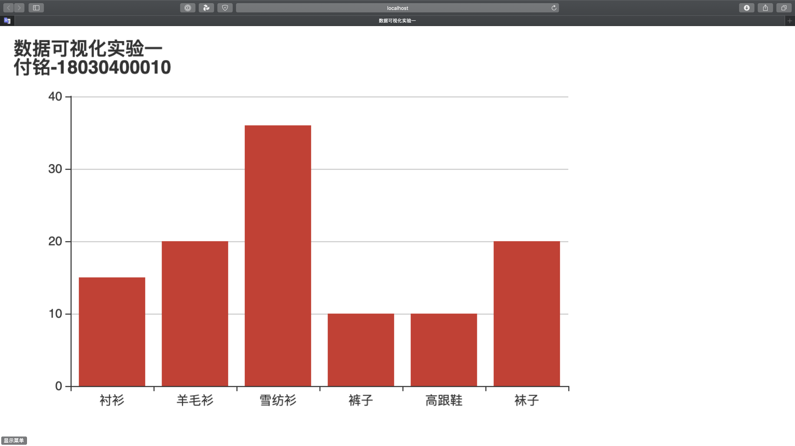
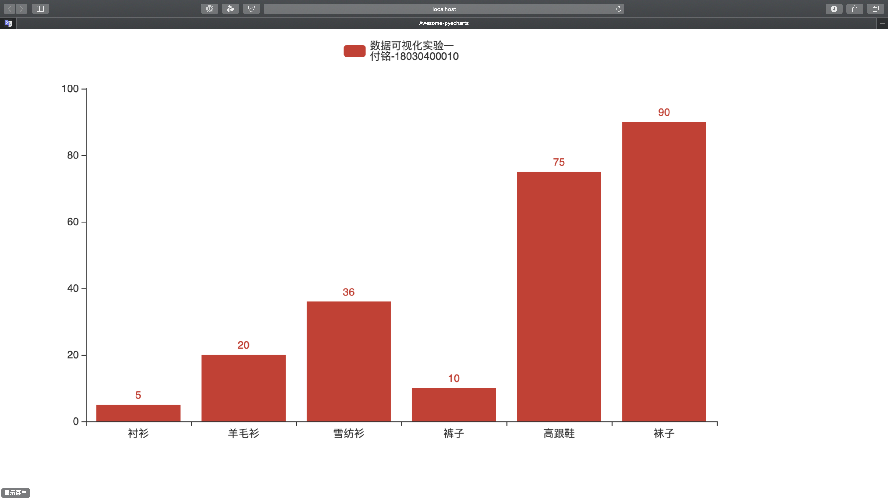
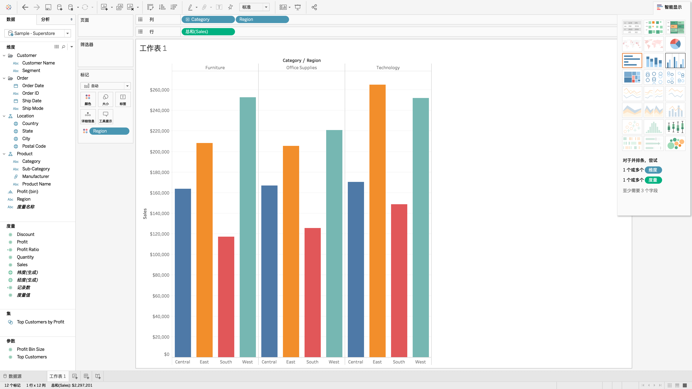

# 数据可视化--实验一：可视化开发环境及搭建

[TOC]

## 概要

+ 学生姓名：付铭
+ 学号：18030400010
+ 学院：计算机科学与技术学院
+ 实验日期：2020-10-13

+ 实验目的： 掌握并安装常用的可视化工具

+ 实验内容：从以下几类工具中选择3种，分别实现一个小案例的绘制：
  + 编程类工具：D3.js、Echarts.js、pyecharts(Python)、 Processing、 R（至少选两种）
  + 交互式工具：Tableau、penRefine（至多选一种）
  + 数据任选

## 实验过程

本次实验选择编程类工具**Echarts.js**和**pyecharts**，交互式工具**Tableau**。

### Echarts.js

+ 使用WebStorm新建Nodejs项目，并使用npm安装Echarts.js和Webpack

+ 在app.js文件中编写逻辑代码，在index.html文件中编写样式代码。

  app.js代码如下

```javascript
/**
 * @name        app.js
 * @author      Fu Ming
 * @Time        2020/10/13 18:49
 * @description 数据可视化实验一：Echarts.js使用示例
 */
var echarts = require('echarts');

// 基于准备好的dom，初始化echarts实例
var myChart = echarts.init(document.getElementById('main'));
// 绘制图表
myChart.setOption({
    title: {
        text: '数据可视化实验一\n'
            + '付铭-18030400010'
    },
    tooltip: {},
    xAxis: {
        data: ['衬衫', '羊毛衫', '雪纺衫', '裤子', '高跟鞋', '袜子']
    },
    yAxis: {},
    series: [{
        name: '销量',
        type: 'bar',
        data: [15, 20, 36, 10, 10, 20]
    }]
});
```

index.html代码如下

```html
<!--Name:   index.html-->
<!--Author: Fu Ming-->
<!--Time:   2020/10/13 18:49-->
<!DOCTYPE html>
<html lang="en">
<head>
    <meta charset="UTF-8">
    <title>数据可视化实验一</title>
</head>
<body>
<div id="main" style="width: 600px;height:400px;"></div>
</body>
<script type="text/javascript" src='bundle.js/main.js'></script>
</html>
```

+ 进行webpack之后在浏览器中打开index.html，结果如下：



Echarts.js样例实验完成。

### pyecharts

+ 在Pycharm中新建Python项目，并使用pip安装pyecharts
+ 在main.py文件中编写逻辑代码，代码如下

```python
#!/usr/bin/env python
# coding:utf-8
"""
Name    : main.py
Author  : Fu Ming
Time    : 2020/10/13 20:47
Desc    : 数据可视化实验一：pyecharts使用实例
"""
from pyecharts.charts import Bar

bar = Bar()
bar.add_xaxis(["衬衫", "羊毛衫", "雪纺衫", "裤子", "高跟鞋", "袜子"])
bar.add_yaxis('数据可视化实验一\n'
              + '付铭-18030400010', [5, 20, 36, 10, 75, 90])
# render 会生成本地 HTML 文件，默认会在当前目录生成 render.html 文件
# 也可以传入路径参数，如 bar.render("mycharts.html")
bar.render()
```

+ 运行main.py文件，然后在浏览器中打开render.html文件，结果如下



pyecharts样例实验完成。

### Tableau

+ 打开Tableau中自带数据源Sample - Superstore
+ 选择其中元素进行可视化操作
+ 结果如下



**数据可视化--实验一：可视化开发环境及搭建实验完成，三项实验结果均符合要求，实验成功。**

