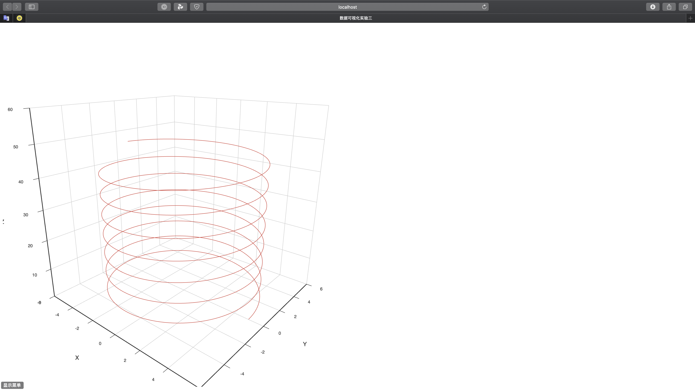
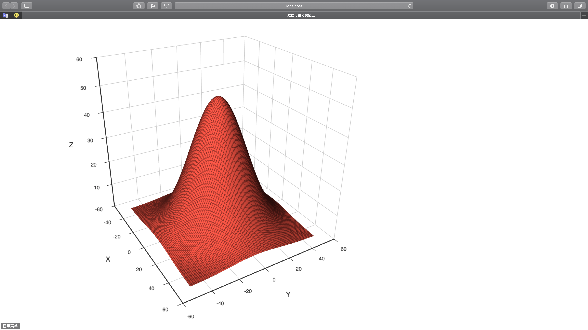
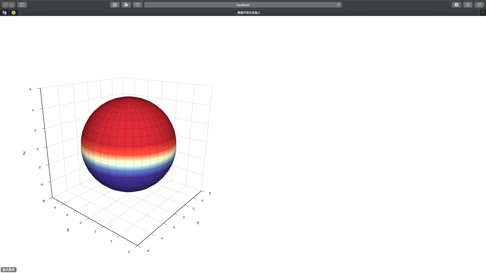

# 数据可视化--实验三：空间可视化

[TOC]

## 概要

+ 学生姓名：付铭
+ 学号：18030400010
+ 学院：计算机科学与技术学院
+ 实验日期：2020-10-13
+ 实验目的： 掌握空间数据可视化工具方法
+ 实验内容：
  + 在3D空间中绘制以下图形：
    + 螺旋曲线（半径为5，每旋转一周z坐标增加π）
    + 二元正态分布曲面
    + 球面（半径为5）

## 实验过程

本次实验选择编程类工具**Echarts**。

### Echarts

​	在WebStorm中新建nodejs项目，并引入echarts，echarts-gl等必要包。

创建index.html，写入以下内容，作为本次实验样式文件。

```html
<!--Name:   index.html-->
<!--Author: Fu Ming-->
<!--Time:   2020/10/13 23:10-->
<!DOCTYPE html>
<html lang="en">
<head>
    <meta charset="UTF-8">
    <title>数据可视化实验三</title>
</head>
<body>
<div id="main" style="width: 1000px;height:1000px;"></div>
</body>
<script type="text/javascript" src='bundle.js/main.js'></script>
</html>
```

#### 螺旋曲线（半径为5，每旋转一周z坐标增加π）

+ 在app.js文件中引入echarts，echarts-gl等包并编写逻辑代码，代码如下

```javascript
/**
 * @name        spiralcurve.js
 * @author      Fu Ming
 * @Time        2020/10/13 23:19
 * @description 绘制螺旋曲线（半径为5，每旋转一周z坐标增加π）
 */
const echarts = require('echarts');
const echartsGL = require('echarts-gl');
// 基于准备好的dom，初始化echarts实例
const myChart = echarts.init(document.getElementById('main'));

// r为螺旋线半径 k为比例因子 k*w为角速度
function spiral(r, k, w) {
    return [r * Math.cos(k * w), r * Math.sin(k * w), k * w]
}

const data = [];
for (let w = 0; w < 30 * Math.PI; w += 0.1)
    data.push(spiral(5, 0.5, w));//构造一个半径为5，每转一周高度增加π的螺旋线
option = {
    grid3D: {},
    xAxis3D: {},
    yAxis3D: {},
    zAxis3D: {max: 60},
    series: [{
        type: 'line3D',
        data: data,
    }]
}
myChart.setOption(option);
```

+ 执行webpack，然后在浏览器中打开index.html文件，结果如下



可以看到半径为5，每旋转一周z坐标增加π的螺旋曲线，实验成功。

#### 二元正态分布曲面

+ 在app.js文件中引入echarts，echarts-gl等包并编写逻辑代码，代码如下

```javascript
/**
 * @name        2D_Gaussian_surface.js
 * @author      Fu Ming
 * @Time        2020/10/13 23:49
 * @description 绘制二元正态分布曲面
 */
const echarts = require('echarts');
const echartsGL = require('echarts-gl');
// 基于准备好的dom，初始化echarts实例
const myChart = echarts.init(document.getElementById('main'));

function makeGaussian(amplitude, x0, y0, sigmaX, sigmaY) {
    return function (amplitude, x0, y0, sigmaX, sigmaY, x, y) {
        const exponent = -(
            (Math.pow(x - x0, 2) / (2 * Math.pow(sigmaX, 2)))
            + (Math.pow(y - y0, 2) / (2 * Math.pow(sigmaY, 2)))
        );
        return amplitude * Math.pow(Math.E, exponent);
    }.bind(null, amplitude, x0, y0, sigmaX, sigmaY);
}

// 创建一个高斯分布函数
const gaussian = makeGaussian(50, 0, 0, 20, 20);
const data = [];
// 曲面图要求给入的数据是网格形式按顺序分布。
for (let y = -50; y <= 50; y++) {
    for (let x = -50; x <= 50; x++) {
        const z = gaussian(x, y);
        data.push([x, y, z]);
    }
}
option = {
    grid3D: {},
    xAxis3D: {},
    yAxis3D: {},
    zAxis3D: {max: 60},
    series: [{
        type: 'surface',
        data: data
    }]
}
myChart.setOption(option);
```

+ 执行webpack，然后在浏览器中打开index.html文件，结果如下



可以看到二元正态分布曲面，实验成功。

#### 球面（半径为5）

+ 在app.js文件中引入echarts，echarts-gl等包并编写逻辑代码，代码如下

```javascript
/**
 * @name        spherical.js
 * @author      Fu Ming
 * @Time        2020/10/13 23:29
 * @description 绘制球面（半径为5）
 */
const echarts = require('echarts');
const echartsGL = require('echarts-gl');
// 基于准备好的dom，初始化echarts实例
const myChart = echarts.init(document.getElementById('main'));
option = {
    tooltip: {},
    visualMap: {
        show: false,
        dimension: 2,
        min: -1,
        max: 1,
        inRange: {
            color: ['#313695', '#4575b4', '#74add1', '#abd9e9', '#e0f3f8', '#ffffbf', '#fee090', '#fdae61', '#f46d43', '#d73027', '#a50026']
        }
    },
    xAxis3D: {},
    yAxis3D: {},
    zAxis3D: {},
    grid3D: {},
    series: [{
        type: 'surface',
        parametric: true,
        // shading: 'albedo',
        parametricEquation: {
            u: {
                min: -Math.PI,
                max: Math.PI,
                step: Math.PI / 20
            },
            v: {
                min: 0,
                max: Math.PI,
                step: Math.PI / 20
            },
            x: function (u, v) {
                return 5 * Math.sin(v) * Math.sin(u);
            },
            y: function (u, v) {
                return 5 * Math.sin(v) * Math.cos(u);
            },
            z: function (u, v) {
                return 5 * Math.cos(v);
            }
        }
    }]
};
myChart.setOption(option);

```

+ 执行webpack，然后在浏览器中打开index.html文件，结果如下



可以看到半径为5的球面，实验成功。

**数据可视化--实验三：空间可视化实验完成，三项实验结果均符合要求，实验成功。**