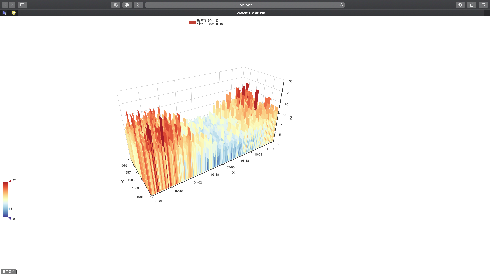

# 数据可视化--实验二：统计图可视化

[TOC]

## 概要

+ 学生姓名：付铭
+ 学号：18030400010
+ 学院：计算机科学与技术学院
+ 实验日期：2020-10-13
+ 实验目的： 掌握统计图可视化工具方法
+ 实验内容：
  + 对daily-minimum-temperatures-in-me.csv中的数据进行处理
  + 使用编程可视化工具实现样本示意图效果

## 实验过程

本次实验选择编程类工具**pyecharts**。

### pyecharts

+ 在Pycharm中新建Python项目，并引入pyecharts，csv等必要包。
+ 在main.py文件中编写逻辑代码，代码如下

```python
#!/usr/bin/env python
# coding:utf-8
"""
Name    : main.py
Author  : Fu Ming
Time    : 2020/10/13 20:47
Desc    : 数据可视化实验二
"""
import csv
import datetime
import pyecharts.options as opts
from pyecharts.charts import Bar3D

filename = 'daily-minimum-temperatures-in-me.csv'
datalist = []
years = set()
monthNday = set()


# readCSV读取了csv文件的内容，并分别拿到了年和日期的集合
def readCSV(filename):
    with open(filename, 'r') as f:
        filedata = csv.reader(f)
        for i in filedata:
            if i.__len__() == 2:
                try:
                    day = datetime.datetime.strptime(i[0], '%Y-%m-%d')
                    years.add(str(day.year))
                    monthNday.add(str("{:0>2d}".format(day.month)) + "-" + str("{:0>2d}".format(day.day)))
                    datalist.append([day, float(i[1])])
                except ValueError:
                    pass


# setToList将years和monthNday转为list并排序
def setToList(years, monthNday):
    years = list(years)
    monthNday = list(monthNday)
    monthNday.sort()
    years.sort()
    return years, monthNday


# shapeData形成图表所需要显示的数据类型
def shapeData():
    showlist = []
    for data in datalist:
        formatDate = str("{:0>2d}".format(data[0].month)) + "-" + str("{:0>2d}".format(data[0].day))
        # #1 日期 #2 年份(真正年份-1981) #3 温度
        date = monthNday.index(formatDate)
        year = years.index(str(data[0].year))
        temperature = data[1]
        showlist.append([date, year, temperature])
    return showlist


def draw():
    Bar3D(init_opts=opts.InitOpts(width="1600px", height="800px")).add(
        series_name="数据可视化实验二\n" + "付铭-18030400010",
        data=showlist,
        xaxis3d_opts=opts.Axis3DOpts(type_="category", data=monthNday),
        yaxis3d_opts=opts.Axis3DOpts(type_="category", data=years),
        zaxis3d_opts=opts.Axis3DOpts(type_="value"),
    ).set_global_opts(
        visualmap_opts=opts.VisualMapOpts(
            max_=25,
            range_color=[
                "#313695",
                "#4575b4",
                "#74add1",
                "#abd9e9",
                "#e0f3f8",
                "#ffffbf",
                "#fee090",
                "#fdae61",
                "#f46d43",
                "#d73027",
                "#a50026",
            ],
        )
    ).render("daily-minimum-temperatures-in-me.html")


if __name__ == '__main__':
    readCSV(filename)
    years, monthNday = setToList(years, monthNday)
    showlist = shapeData()
    draw()
```

+ 运行main.py文件，然后在浏览器中打开daily-minimum-temperatures-in-me.html文件，结果如下



实验结果与样本示意图相同。

**数据可视化--实验二：统计图可视化实验完成，实验结果符合要求，实验成功。**


