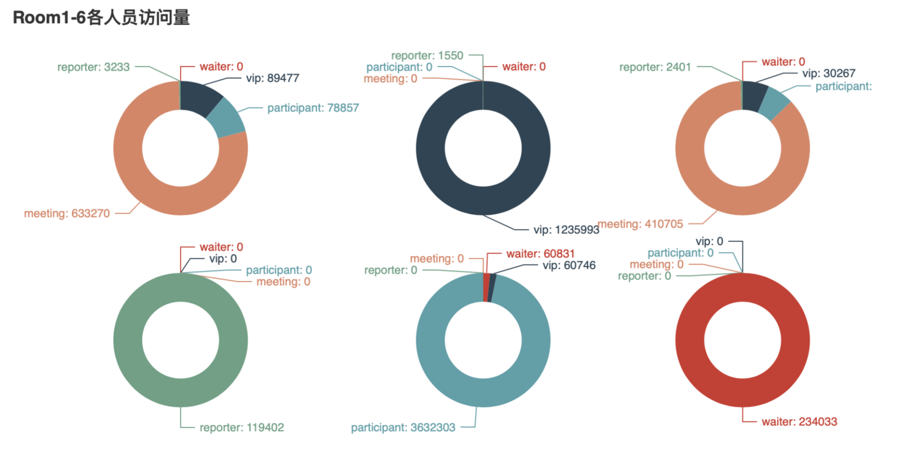

# 数据可视化--实验五：高维非空间数据可视化

[TOC]

## 概要

+ 学生姓名：付铭
+ 学号：18030400010
+ 学院：计算机科学与技术学院
+ 实验日期：2020-10-15
+ 实验目的： 掌握高维非空间数据可视化
+ 实验内容：
  + 在某次大型会议中，为确保会议过程安全，会场使用了电子胸牌对场内人员的移动轨迹进行了监控。现经过处理，得到了某一天内人员在场内各个区域逗留的时间统计数据（time_allocate_day1.csv）。请根据这份数据，完成以下任务：
    + 1、设计可视化方案，要求通过该方案可以实现对人员的分类（分类结果已给出，仅绘制出图像即可）
    + 2、请根据上述图像，分析会场中room1~6的功能。

## 实验过程

本次实验选择编程类工具**Pyecharts**。

### Pyecharts

​	在Pycharm中新建python项目，并引入pyecharts，openpyxl，datetime等必要包。

创建main.py，写入以下内容。

```python
#!/usr/bin/env python
# coding:utf-8
"""
Name    : main.py
Author  : Fu Ming
Time    : 2020/10/15 20:09
Desc    : 数据可视化实验五
"""
import openpyxl
from pyecharts.charts import HeatMap, Parallel
import pyecharts.globals as globals
from pyecharts import options as opts
from pyecharts.charts import Pie

globals._WarningControl.ShowWarning = False  # 关闭pyecharts给出的警告


def getClassifyData():
    filename = "classifyday1.xlsx"
    ws = openpyxl.load_workbook(filename)['classifyday1']
    classifyData = []
    for i in range(2, ws.max_row + 1):
        row = str(i)
        classifyData.append([ws['A' + row].value, ws['B' + row].value])
    return classifyData


# 从表格读取数据
def getRoomData():
    filename = "time_allocate_day1.xlsx"
    ws = openpyxl.load_workbook(filename)['time_allocate_day1']
    roomData, roomName = [], []
    for room in range(24):
        roomName.append(
            opts.ParallelAxisOpts(dim=room, name=ws[chr(room + 65) + '1'].value, min_='dataMin', max_='dataMax'))
    for i in range(2, ws.max_row + 1):
        row, person = str(i), []
        for room in range(24):
            person.append(ws[chr(room + 65) + row].value)
        roomData.append(person)
    return roomData, roomName


# 不同人员平行坐标系图
def drawRoomDataParallel():
    roomData, roomName = getRoomData()
    c = (
        Parallel(init_opts=opts.InitOpts(width="2000px", height="1000px")).add_schema(
            roomName).add(series_name="人员分类图",
                          data=roomData,
                          linestyle_opts=opts.LineStyleOpts(color={'type': 'linear', 'x': 0,
                                                                   'y': 0,
                                                                   'x2': 0,
                                                                   'y2': 1,
                                                                   'colorStops': [{
                                                                       'offset': 0, 'color': 'red'
                                                                   }, {
                                                                       'offset': 1,
                                                                       'color': 'blue'
                                                                   }],
                                                                   'global': False
                                                                   }, opacity=0.5)
                          ).set_global_opts(title_opts=opts.TitleOpts(title="数据可视化实验五"))
    )
    c.render("不同人员平行坐标系图.html")


def genHeatBaseData():
    x, y = [], []
    for i in range(100):
        fmt = str("{:0>2d}".format(i))
        x.append(fmt)
        y.append('1' + fmt)
    return x, y


def classifyHeatMap(xAxisData: list, yAxisData: list, data: list):
    HeatMap(init_opts=opts.InitOpts(width="2000px", height="2000px")).add_xaxis(xaxis_data=xAxisData).add_yaxis(
        series_name="classifyHeatMap",
        yaxis_data=yAxisData,
        value=data,
        label_opts=opts.LabelOpts(
            is_show=False, color="#fff", position="bottom", horizontal_align="50%"
        ),
    ).set_series_opts().set_global_opts(
        legend_opts=opts.LegendOpts(is_show=True),
        xaxis_opts=opts.AxisOpts(
            type_="category",
            splitarea_opts=opts.SplitAreaOpts(
                is_show=True, areastyle_opts=opts.AreaStyleOpts(opacity=1)
            ),
            axislabel_opts=opts.LabelOpts(
                interval=0
            )
        ),
        yaxis_opts=opts.AxisOpts(
            type_="category",
            splitarea_opts=opts.SplitAreaOpts(
                is_show=True, areastyle_opts=opts.AreaStyleOpts(opacity=1)
            ),
        ),
        visualmap_opts=opts.VisualMapOpts(
            orient="horizontal", pos_left="center", is_piecewise=True,
            pieces=[
                {"value": 2, "label": 'waiter'},
                {"value": 4, "label": 'vip'},
                {"value": 6, "label": 'participant'},
                {"value": 8, "label": 'meeting'},
                {"value": 10, "label": 'reporter'},
            ]
        ),
    ).render("classifyHeatMap.html")


def serializeClassifyData(data: list):
    job = {'waiter': 2, 'vip': 4, 'participant': 6, 'meeting': 8, 'reporter': 10}
    sData = {}
    for person in data:
        if not sData.__contains__(str(person[0])[0:3]):
            sData[str(person[0])[0:3]] = {}
        sData[str(person[0])[0:3]][str(person[0])[3:5]] = job[person[1]]
    return sData


def genClassifyHeatMapData(data: dict):
    rdata = []  # data中的每个列表内容依次是横坐标 纵坐标 值
    for k, v in data.items():
        for sk, sv in v.items():
            rdata.append([int(sk), int(k) - 100, sv])
    return rdata


def drawClassifyHeatMap():
    classifyData = getClassifyData()
    serializedClassifyData = serializeClassifyData(classifyData)
    xAxisValue, yAxisValue = genHeatBaseData()
    classifyHeatMapData = genClassifyHeatMapData(serializedClassifyData)
    classifyHeatMap(xAxisValue, yAxisValue, classifyHeatMapData)


# 计算每种人去了每个房间的总和
def getRoomData():
    classifyData = getClassifyData()
    serializedClassifyData = serializeClassifyData(classifyData)
    filename = "time_allocate_day1.xlsx"
    ws = openpyxl.load_workbook(filename)['time_allocate_day1']
    roomData = [[0, 0, 0, 0, 0, 0], [0, 0, 0, 0, 0, 0], [0, 0, 0, 0, 0, 0], [0, 0, 0, 0, 0, 0], [0, 0, 0, 0, 0, 0]]
    for i in range(2, ws.max_row + 1):
        row = str(i)
        for room in range(6):
            roomData[((serializedClassifyData[str(ws['A' + row].value)[0:3]][
                str(ws['A' + row].value)[3:5]]) // 2) - 1][room] += ws[chr(103 + room) + row].value
    # roomData=[[0, 0, 0, 0, 60831, 234033], [89477, 1235993, 30267, 0, 60746, 0], [78857, 0, 30304, 0, 3632303, 0],
    # [633270, 0, 410705, 0, 0, 0], [3233, 1550, 2401, 119402, 0, 0]]
    return roomData


# 计算每个房间都被多少人呆过的总和
def getRoomData2(roomData: list):
    roomData2 = [[], [], [], [], [], []]
    for i in roomData:
        k = 0
        for v in i:
            roomData2[k].append(v)
            k += 1
    # roomData2=[[0, 89477, 78857, 633270, 3233], [0, 1235993, 0, 0, 1550], [0, 30267, 30304, 410705, 2401],[0, 0, 0,
    # 0, 119402], [60831, 60746, 3632303, 0, 0], [234033, 0, 0, 0, 0]]
    return roomData2


def drawRoomData2Pie():
    roomData2 = getRoomData2(getRoomData())
    jobs = ['waiter', 'vip', 'participant', 'meeting', 'reporter']
    newData = [[], [], [], [], [], []]
    k = 0
    for room in roomData2:
        i = 0
        for job in room:
            newData[k].append([jobs[i], job])
            i += 1
        k += 1
    k = 0
    pieCenter = [["20%", "30%"], ["55%", "30%"], ["85%", "30%"], ["20%", "70%"], ["55%", "70%"], ["85%", "70%"]]
    pie = Pie()
    for data in newData:
        pie.add("Room" + str(k + 1), data, center=pieCenter[k], radius=[40, 70])
        k += 1
    pie.set_global_opts(
        title_opts=opts.TitleOpts(title="Room1-6各人员访问量"),
        legend_opts=opts.LegendOpts(is_show=False),
    ).set_series_opts(label_opts=opts.LabelOpts(formatter="{b}: {c}", is_show=True))
    pie.render("roomTime.html")


if __name__ == '__main__':
    # drawClassifyHeatMap() # 热力图是在已知人员分类的情况下画出来的，但是第一问的前提是不知道人员分类
    # 用平行坐标系画图
    drawRoomDataParallel()
    # 1:休息区 2:嘉宾休息区 3:休息区 4:记者区 5:黑客竞赛现场 6：工作人员休息区
    drawRoomData2Pie()
```

代码流程：

+ 读取Excel文件time_allocate_day1.xlsx
+ ~~拿到数据中每个id对应的职位。~~
+ ~~因为id为5位，前三位范围为100-199，后两位范围为0-99，所以以前三位为纵轴，后三位为横轴，画出个人职位热力图，热力图中不同颜色代表着不同职位。~~
+ ~~画出热力图，即可通过该热力图可以实现对人员的分类。任务一“设计可视化方案，要求通过该方案可以实现对人员的分类（分类结果已给出，仅绘制出图像即可）”完成。~~
+ 任务一“设计可视化方案，要求通过该方案可以实现对人员的分类（分类结果已给出，仅绘制出图像即可）“要求在不知道人员分类的前提下实现对人员的分类，所以上述热力图方案不可使用，因为数据有24维，故选择绘制平行坐标系。
+ 画出平行坐标系，即可通过该热力图可以实现对人员的分类。任务一“设计可视化方案，要求通过该方案可以实现对人员的分类（分类结果已给出，仅绘制出图像即可）”完成
+ 读取Excel文件time_allocate_day1.xlsx和classifyday1.xlsx
+ 拿到每个房间不同人员所处的时长总和。
+ 画出每个房间不同人员所处时长的饼图。
+ 观察图像，得出结论。

### 实验结果

### 平行坐标系

人员分类平行坐标系如下所示，可以通过此图观察分辨某人职位


### room1-6房间人员时长饼图



上图从左到右从上到下依次是Room1-6的房间人员访问量。

对上图进行分析：

+ Room1和Room3被访问最多的是meeting，所以认为两个房间是休息区
+ Room2绝大多是被vip访问，所以可以认为是嘉宾休息区
+ Room4绝大多是reporter访问，所以可以认为Room4是记者区
+ Room5绝大多是participant访问，所以可以认为Room4是黑客竞赛现场
+ Room6绝大多是waiter访问，所以可以认为Room4是工作人员休息区

所以结论为：**Room1:休息区 Room2:嘉宾休息区 Room3:休息区 Room4:记者区 Room5:黑客竞赛现场 Room6：工作人员休息区**

**数据可视化--实验五：高维非空间数据可视化实验完成，两项实验结果均符合要求，实验成功。**

