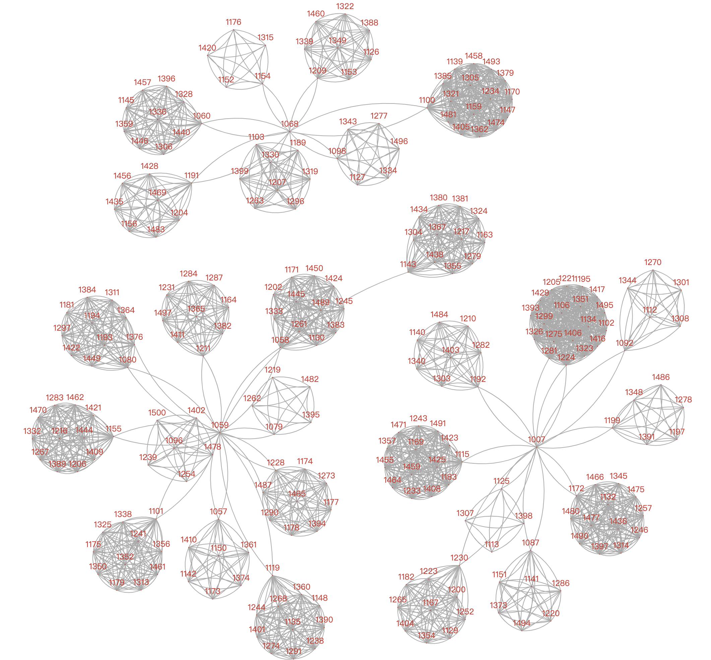

# 数据可视化--实验六：层次和网络可视化、文本可视化

[TOC]

## 概要

+ 学生姓名：付铭
+ 学号：18030400010
+ 学院：计算机科学与技术学院
+ 实验日期：2020-10-17
+ 实验目的： 掌握层次和网络可视化、文本可视化工具方法
+ 实验内容：
  + 现有xx公司一个月内研发部门成员间的邮件往来记录（email_dev_inside.xlsx），请根据以下要求完成对该公司的研发部门的可视化分析：
    + 1、对邮件往来数据进行处理，选择合适的图表，展示公司研发部门的成员组织结构，分别找出每个群体的负责人。
    + 2、对邮件内容数据进行处理，分析研发部门以及每个群体中的主要工作内容。

## 实验过程

本次实验选择编程类工具**Pyecharts**。

### Pyecharts

​	在Pycharm中新建python项目，并引入pyecharts，openpyxl等必要包。

创建main.py，写入以下内容。

```python
#!/usr/bin/env python
# coding:utf-8
"""
Name    : main.py
Author  : Fu Ming
Time    : 2020/10/17 21:03
Desc    : 数据可视化实验六
"""
import copy
import openpyxl
from pyecharts.charts import Graph, Tree, WordCloud, Page
from pyecharts import options as opts
from pyecharts import globals

globals._WarningControl.ShowWarning = False  # 关闭pyecharts给出的警告

bigBoss = ['1007', '1059', '1068']


def getData():
    filename = "email_dev_inside.xlsx"
    ws = openpyxl.load_workbook(filename)['Sheet1']
    theData, resNodes, theLinks, theCategories, theNodes = [], [], [], [], set()
    for i in range(2, ws.max_row + 1):
        row = str(i)
        theData.append([ws['G' + row].value[:4], ws['H' + row].value[:4], ws['I' + row].value])
        theLinks.append({'source': ws['G' + row].value[:4], 'target': ws['H' + row].value[:4]})
        theNodes.add(ws['G' + row].value[:4])
        theNodes.add(ws['H' + row].value[:4])
    for node in theNodes:
        resNodes.append({'name': node, 'symbolSize': 1, 'draggable': 'False', 'value': 1, 'category': '',
                         'label': {'normal': {'show': 'False'}}})
    return theData, resNodes, theLinks, theCategories


def drawEmailGraph(graph_nodes: list, graph_links: list, graph_categories: list):
    Graph(opts.InitOpts(width="2000px", height="2000px")).add(
        "",
        graph_nodes,
        graph_links,
        graph_categories,
        repulsion=50,
        linestyle_opts=opts.LineStyleOpts(curve=0.2),
        label_opts=opts.LabelOpts(is_show=False),
    ).set_global_opts(
        legend_opts=opts.LegendOpts(is_show=False),
        title_opts=opts.TitleOpts(title="研发部邮件来往图"),
    ).render("研发部邮件来往图.html")


def getLittleBoss(big_boss: list):
    little_boss = {}
    for bBoss in big_boss:
        little_boss[bBoss] = set()
    for link in links:
        if link['source'] in big_boss and link['target'] not in bigBoss:
            little_boss[link['source']].add(link['target'])
        elif link['target'] in big_boss and link['source'] not in bigBoss:
            little_boss[link['target']].add(link['source'])
    for k, v in little_boss.items():
        little_boss[k] = list(v)
        little_boss[k].sort()
    return little_boss


def getRank():
    the_rank = {}
    for bBoss in bigBoss:
        the_rank[bBoss] = {}
    littleBoss = getLittleBoss(bigBoss)
    for k, v in littleBoss.items():
        employee = getLittleBoss(v)
        for lBoss in v:
            the_rank[k][lBoss] = employee[lBoss]
    return the_rank


def getGroupEmail():
    email_content = copy.deepcopy(rank)
    for bBoss, groups in email_content.items():
        for lBoss, employeeList in groups.items():
            email_content[bBoss][lBoss] = getListEmail(employeeList)
    return email_content


def getListEmail(theEmployeeList: list):
    emailContent = {}
    wordList = []
    for d in data:
        if d[0] in theEmployeeList or d[1] in theEmployeeList:
            if emailContent.__contains__(d[2]):
                emailContent[d[2]] += 1
            else:
                emailContent[d[2]] = 0
    for k, v in emailContent.items():
        wordList.append(tuple((k, str(v))))
    return wordList


def getTreeData():
    tree_data, children = {'name': '成员结构图', 'children': []}, []
    for bBoss, groups in rank.items():
        tree_data['children'].append({'name': bBoss, 'children': []})
        for lBoss, employeeList in groups.items():
            for employee in employeeList:
                children.append({'name': employee, 'value': 1})
            tree_data['children'][tree_data['children'].__len__() - 1]['children'].append(
                {'name': lBoss, 'children': children})
            children = []
    return tree_data


def drawTree(tree_data):
    Tree(opts.InitOpts(width="3500px", height="2000px")).add(
        "",
        [tree_data],
        collapse_interval=2,
        orient="TB",
        initial_tree_depth=-1,
        label_opts=opts.LabelOpts(
            position="top",
            horizontal_align="right",
            vertical_align="middle",
            rotate=-90,
        ),
    ).set_global_opts(title_opts=opts.TitleOpts(title="成员结构图")).render("成员结构图.html")


def drawWordCloud(cloud_data: dict):
    page = Page()
    for bBoss, groups in cloud_data.items():
        for lBoss, employeeList in groups.items():
            wordCloud = WordCloud()
            wordCloud.add(series_name=bBoss + '-' + lBoss + "邮箱内容分析", data_pair=employeeList,
                          word_size_range=[6, 66]).set_global_opts(
                title_opts=opts.TitleOpts(
                    title=bBoss + '-' + lBoss + "邮箱内容分析", title_textstyle_opts=opts.TextStyleOpts(font_size=23)
                ),
                tooltip_opts=opts.TooltipOpts(is_show=True),
            )
            page.add(wordCloud)
    page.render("邮箱内容分析.html")


if __name__ == '__main__':
    data, nodes, links, categories = getData()  # 从xlsx拿到数据
    rank = getRank()  # 拿到整个阶级顺序
    drawEmailGraph(nodes, links, categories)  # 画出邮件来往网络图
    drawTree(getTreeData())  # 画出阶级图
    drawWordCloud(getGroupEmail())  # 画出每个群体的邮件内容词云

# 由EmailGraph可见，研发部分为3个群体。群体负责人的邮箱用户名依次是1007，1059，1068。
# 群体之间都不会互相通信，同时每个群体又分为多个小群体，小群体之间同样也不会互相通信。
# 拿到3个大群体的负责人之后，可以拿到这三个人的通信记录，便可以得到每个小群体的主要负责人。
# 同样地，可以拿到每个小群体的成员，拿的时候要注意避免将3个大群体的负责人认作为小群体的成员。
# 然后对每个大群体和小群体的邮件内容生成词云，即可获得每个群体的工作内容。

# 由Tree可以清晰地看出来部门的层次
# 由WordCloud可以看出来每个群体的主要工作内容
```

代码流程：

+ 读取Excel文件email_dev_inside.xlsx拿到往来邮件的邮箱用户名(四位数字)和邮件主题。
+ 根据往来邮件的邮箱用户名画出网络图，观察部门群体形态。
+ 根据部门群体形态可以判断出研发部分为3个群体。群体负责人的邮箱用户名依次是1007，1059，1068。群体之间都不会互相通信，同时每个群体又分为多个小群体，小群体之间同样也不会互相通信。
+ 根据群体负责人和小群体负责人，划分出部门的职位树图。
+ 根据划分的不同小群体及其邮件主题，画出每个小群体的邮件主题词云图。
+ 观察词云图，可以得出每个群体的主要工作内容。

### 实验结果

### 邮件往来网络图

邮件往来网络图如下所示，可以通过网络图可以得出主要负责人。



对上图进行分析：

+ 此研发部门主要分为3个群体，负责人的邮箱用户名依次是1007，1059和1068
+ 每个群体又分为不同的小群体，并且每个小群体中有一个负责人。
+ 每个大群体之间不会相互通信，每个小群体之间也不会相互通信。

### 职位树图


对上图进行分析：

+ 可以清晰地看出整个部门的结构层次，图中数字为邮箱用户名。

### 邮件主题词云图


对上图进行分析：

+ 由邮件主题词云图可以看出每个小群体的主要工作，以负责人邮箱用户名为索引，结论如下：
+ 1007
  + 1087：技术分享安排，部署与计划
  + 1092：需求、API、项目计划、问题与风险
  + 1115：前端开发、测试、配置、部署
  + 1125：概要设计、文档撰写
  + 1172：开发设计、实施方案
  + 1192：特殊字段说明、用户管理与例会
  + 1199：后端开发、文档接口与平台
  + 1224：软件部署运维
  + 1230：软件测试
  + 1281：软件部署与实施测试
+ 1059
  + 1057：软件开发实施监管
  + 1058：软件概要设计
  + 1079：技术分享
  + 1080：需求调研、设计概要
  + 1096：软件实施
  + 1101：系统配置子系统相关
  + 1119：软件实施与数据分析
  + 1143：总监管
  + 1155：特殊字段说明
  + 1211：软件开发文档撰写
  + 1228：软件实施与地图配置
  + 1376：需求调研与传输设置、特殊字段处理
  + 1487：系统规划，需求与原型设计
+ 1068
  + 1060：地图配置
  + 1098：工程初验
  + 1100：平台配置设置
  + 1154：地图配置
  + 1191：工程测试与终验
  + 1207：项目测试数据处理
  + 1209：软件开发文档管理

## 实验结论

+ 研发部负责人树状图和其下人员的主要工作如下所示，其中数字为人员邮箱用户名（即邮箱前四位数字）
+ 1007
  + 1087：技术分享安排，部署与计划
  + 1092：需求、API、项目计划、问题与风险
  + 1115：前端开发、测试、配置、部署
  + 1125：概要设计、文档撰写
  + 1172：开发设计、实施方案
  + 1192：特殊字段说明、用户管理与例会
  + 1199：后端开发、文档接口与平台
  + 1224：软件部署运维
  + 1230：软件测试
  + 1281：软件部署与实施测试
+ 1059
  + 1057：软件开发实施监管
  + 1058：软件概要设计
  + 1079：技术分享
  + 1080：需求调研、设计概要
  + 1096：软件实施
  + 1101：系统配置子系统相关
  + 1119：软件实施与数据分析
  + 1143：总监管
  + 1155：特殊字段说明
  + 1211：软件开发文档撰写
  + 1228：软件实施与地图配置
  + 1376：需求调研与传输设置、特殊字段处理
  + 1487：系统规划，需求与原型设计
+ 1068
  + 1060：地图配置
  + 1098：工程初验
  + 1100：平台配置设置
  + 1154：地图配置
  + 1191：工程测试与终验
  + 1207：项目测试数据处理
  + 1209：软件开发文档管理

**数据可视化--实验六：层次和网络可视化、文本可视化实验完成，两项实验结果均符合要求，实验成功。**

