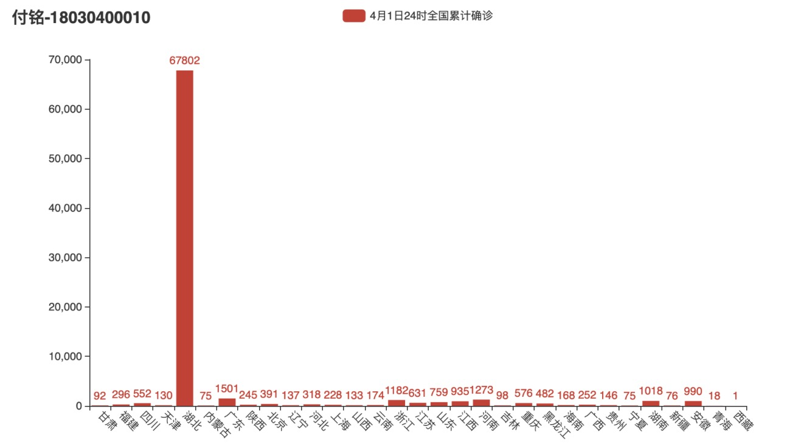
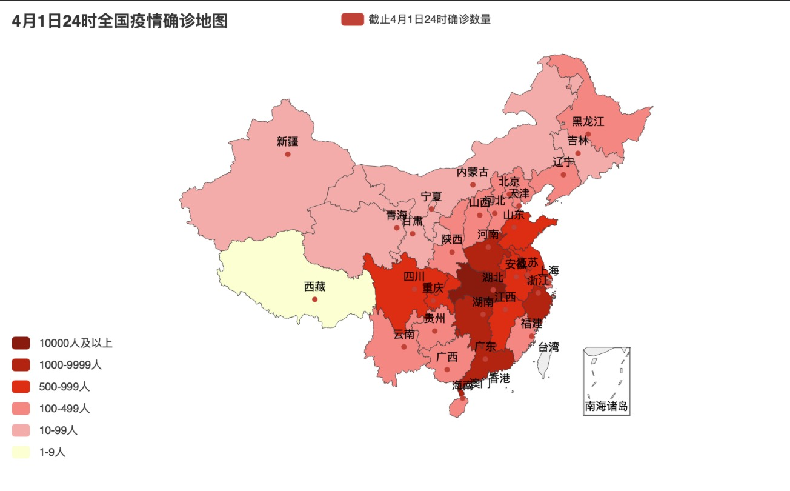
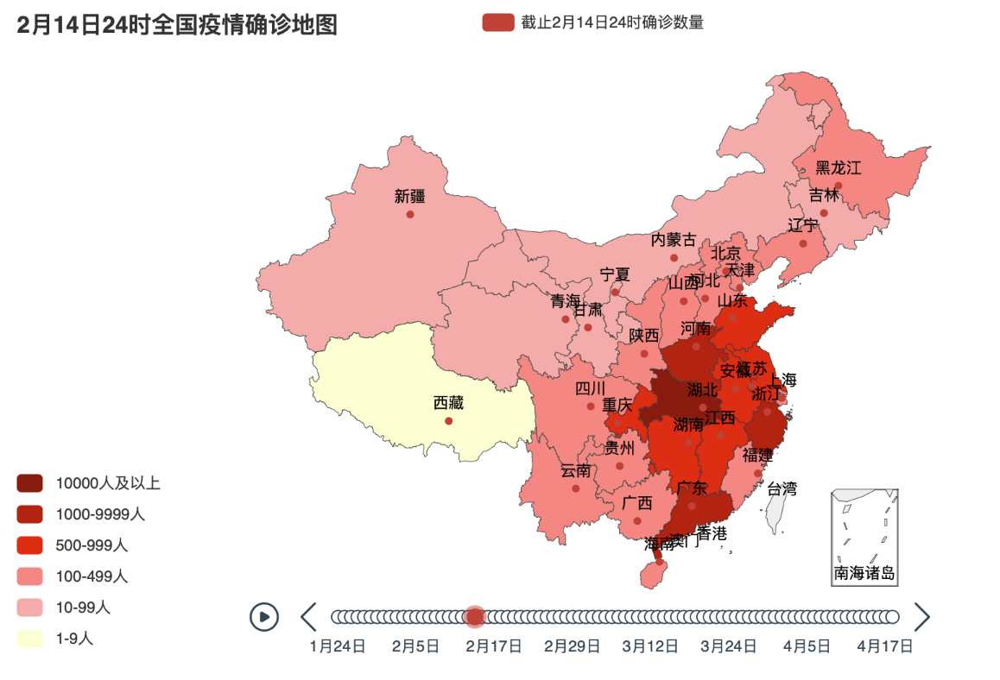

# 数据可视化--实验四：地理数据可视化

[TOC]

## 概要

+ 学生姓名：付铭
+ 学号：18030400010
+ 学院：计算机科学与技术学院
+ 实验日期：2020-10-13
+ 实验目的： 掌握地理数据可视化工具方法
+ 实验内容：
  + 利用已有数据（CityData.xlsx）与已有工具，设计可视化方案，展示2020年全国新冠患者人数随时间的变化过程，并完成以下任务。
    + 统计截止4月1日各省的累计确诊数量，并通过图表展示。
    + 对每日各省的累计确诊患者数量进行统计，为图像添加时间轴，通过时间轴自动播放演示疫情发展的整个过程。

## 实验过程

本次实验选择编程类工具**Pyecharts**。

### Pyecharts

​	在Pycharm中新建python项目，并引入pyecharts，openpyxl，datetime等必要包。

创建main.py，写入以下内容。

```python
#!/usr/bin/env python
# coding:utf-8
"""
Name    : main.py
Author  : Fu Ming
Time    : 2020/10/14 08:42
Desc    : 数据可视化实验四
"""
import time
import datetime
import openpyxl
from pyecharts.charts import Map, Timeline, Bar
from pyecharts import globals, options

globals._WarningControl.ShowWarning = False  # 关闭pyecharts给出的警告

filename = "CityData.xlsx"
ws = openpyxl.load_workbook(filename)['CityData']


# 两天相减，拿到相差的天数
def subdays(date1: time, date2: time):
    return (datetime.datetime(date1[0], date1[1], date1[2]) - datetime.datetime(date2[0], date2[1], date2[2])).days


# 通过某运算法则选出a，b其中一个，选a返回True，选b返回False
#  a     b   return
#  正    正    min
#  正   非正   False
# 非正   正    True
# 非正  非正    max
def getMostLeftNear(a, b):
    if (a > 0 and b > 0) or (a <= 0 and b <= 0):
        return abs(a) < abs(b)
    elif (a > 0 and b <= 0) or (a <= 0 and b > 0):
        return b > 0


# 认为截止至某天的24时，获取到截止到此刻的省市直辖市自治区的累计确诊人数。我已经不想看这段代码了，建议不看。
def confirmedAt(dateTime: time):
    data, date = {}, {}
    for i in range(2, ws.max_row):
        # 如果已经有这个省的日期了
        row = str(i + 1)
        if date.__contains__(ws['B' + row].value):
            dirdate_april1 = subdays(time.strptime(
                "2020-" + str(date[ws['B' + row].value]['month']) + "-" + str(date[ws['B' + row].value]['day']),
                "%Y-%m-%d"), dateTime)
            wsdate_april1 = subdays(
                time.strptime("2020-" + str(ws['H' + row].value.month) + "-" + str(ws['H' + row].value.day),
                              "%Y-%m-%d"), dateTime)
        if date.__contains__(ws['B' + row].value) and getMostLeftNear(wsdate_april1, dirdate_april1):
            date[ws['B' + row].value]['month'] = ws['H' + row].value.month
            date[ws['B' + row].value]['day'] = ws['H' + row].value.day
        elif not date.__contains__(ws['B' + row].value):
            date[ws['B' + row].value] = {'month': ws['H' + row].value.month, 'day': ws['H' + row].value.day}
    for i in range(2, ws.max_row):
        row = str(i + 1)
        wsdate = ws['H' + row].value
        if wsdate.month == date[ws['B' + row].value]['month'] and wsdate.day == date[ws['B' + row].value]['day']:
            if data.__contains__(ws['B' + row].value):
                data[ws['B' + row].value] += ws['D' + row].value
            else:
                data[ws['B' + row].value] = ws['D' + row].value
    datalist = []
    for k, v in data.items():
        datalist.append([k.strip("省").strip("市").strip("自治区").strip("壮族").strip("回族").strip("维吾尔"), v])
    return datalist


def drawConfirmedMapAt(dateTime: time):
    map = Map()
    map.set_global_opts(
        title_opts=options.TitleOpts(title=str(dateTime[1]) + '月' + str(dateTime[2]) + "日24时全国疫情确诊地图"),
        visualmap_opts=options.VisualMapOpts(max_=3600, is_piecewise=True,
                                             pieces=[
                                                 {"max": 1999999, "min": 10000, "label": "10000人及以上",
                                                  "color": "#8A0808"},
                                                 {"max": 9999, "min": 1000, "label": "1000-9999人", "color": "#B40404"},
                                                 {"max": 999, "min": 500, "label": "500-999人", "color": "#DF0101"},
                                                 {"max": 499, "min": 100, "label": "100-499人", "color": "#F78181"},
                                                 {"max": 99, "min": 10, "label": "10-99人", "color": "#F5A9A9"},
                                                 {"max": 9, "min": 0, "label": "1-9人", "color": "#FFFFCC"},
                                             ], )  # 最大数据范围，分段
    )
    map.add("截止" + str(dateTime[1]) + '月' + str(dateTime[2]) + "日24时确诊数量", data_pair=confirmedAt(dateTime),
            maptype="china", is_roam=True)
    map.render(str(dateTime[1]) + '月' + str(dateTime[2]) + "日24时全国疫情确诊地图.html")


def getAllDate():
    date = set()
    for i in range(2, ws.max_row):
        curdate = ws['H' + str(i + 1)].value
        date.add(time.strptime(str(curdate.year) + '-' + str(curdate.month) + '-' + str(curdate.day), "%Y-%m-%d"))
    date = list(date)
    date.sort()
    return date


# 画出所有时间的疫情累计确诊地图
# 因为函数confirmedAt(dateTime: time)的时间复杂度高达O(n),所以本函数时间复杂度高达O(n^2),肉眼可见他很慢
def drawAllConfirmedMap():
    tl = Timeline()
    date = getAllDate()
    for curdate in date:
        map = (
            Map().add("截止" + str(curdate[1]) + '月' + str(curdate[2]) + "日24时确诊数量", data_pair=confirmedAt(curdate),
                      maptype="china", is_roam=True).set_global_opts(
                title_opts=options.TitleOpts(title=str(curdate[1]) + '月' + str(curdate[2]) + "日24时全国疫情确诊地图"),
                visualmap_opts=options.VisualMapOpts(max_=3600, is_piecewise=True,
                                                     pieces=[
                                                         {"max": 1999999, "min": 10000, "label": "10000人及以上",
                                                          "color": "#8A0808"},
                                                         {"max": 9999, "min": 1000, "label": "1000-9999人",
                                                          "color": "#B40404"},
                                                         {"max": 999, "min": 500, "label": "500-999人",
                                                          "color": "#DF0101"},
                                                         {"max": 499, "min": 100, "label": "100-499人",
                                                          "color": "#F78181"},
                                                         {"max": 99, "min": 10, "label": "10-99人", "color": "#F5A9A9"},
                                                         {"max": 9, "min": 0, "label": "1-9人", "color": "#FFFFCC"},
                                                     ], )  # 最大数据范围，分段
            )
        )
        tl.add(map, str(curdate[1]) + '月' + str(curdate[2]) + "日")
        print(str(curdate[1]) + '月' + str(curdate[2]) + "日完成")
    tl.render("全国疫情确诊地图.html")


def drawConfirmedBarAt(dateTime: time):
    data = confirmedAt(dateTime)
    title = str(dateTime[1]) + '月' + str(dateTime[2]) + "日24时全国累计确诊"
    province, confirmed = [], []
    for curdata in data:
        province.append(curdata[0])
        confirmed.append(curdata[1])
    bar = Bar()
    bar.add_xaxis(province).add_yaxis(
        title, confirmed
    ).set_global_opts(
        title_opts=options.TitleOpts(title="Bar-基本示例", subtitle="我是副标题"),
        xaxis_opts=options.AxisOpts(axislabel_opts=options.LabelOpts(rotate=-45)),
    ).render(
        title + ".html"
    )
    print(title)


drawConfirmedBarAt(time.strptime("2020-04-01", "%Y-%m-%d"))
# drawConfirmedMapAt(time.strptime("2020-04-01", "%Y-%m-%d"))  # 画出4月1号的疫情地图
drawAllConfirmedMap()  # 画出所有时间的疫情地图
```

代码流程：

	+ 读取Excel文件
	+ 拿到数据中每个省份截止到4月1号前的最新日期，因为数据中有些省份缺失4月1日的数据
	+ 拿到每个省份截止到4月1号前的最新日期的确诊数量
	+ 画出确诊数量的柱状图，也可以画出疫情地图，这样也就完成了任务一“截止4月1日各省的累计确诊数量”。
	+ 拿到每个省份每天的确诊数量
	+ 使用时间轴和Map画出整个时间的疫情地图，并且可以自动播放，这样也就完成了任务二“对每日各省的累计确诊患者数量进行统计，为图像添加时间轴，通过时间轴自动播放演示疫情发展的整个过程”。

### 实验结果

运行上述代码，画出4月1日全国的累积确诊柱状图和疫情地图，如下图



上图为4月1日全国的累积确诊柱状图，同样也可以画出4月1日全国的累积确诊疫情地图，如下图



全国疫情地图时间轴如下图



**数据可视化--实验四：地理数据可视化实验完成，两项实验结果均符合要求，实验成功。**